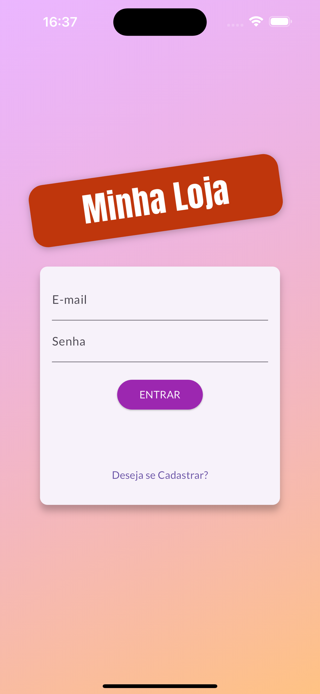
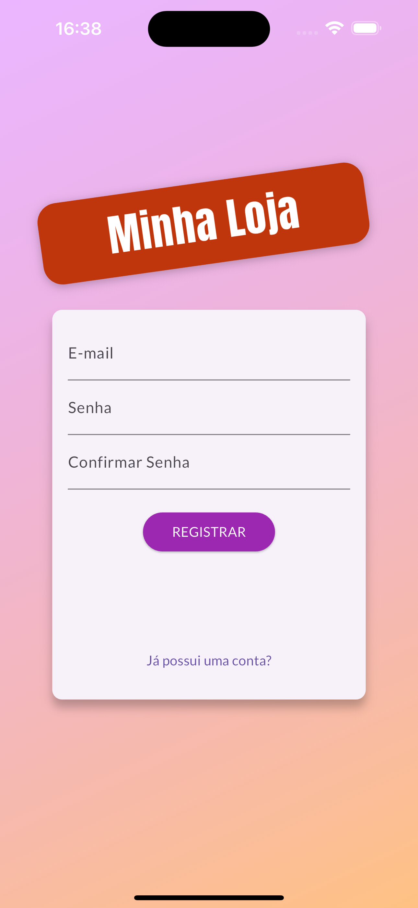
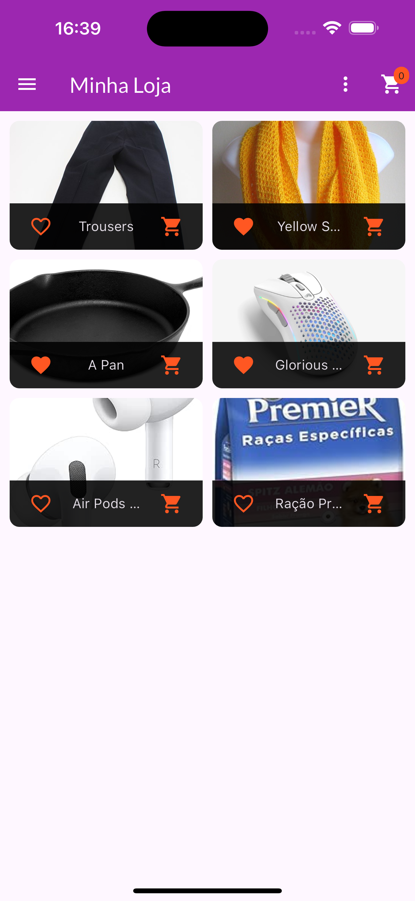
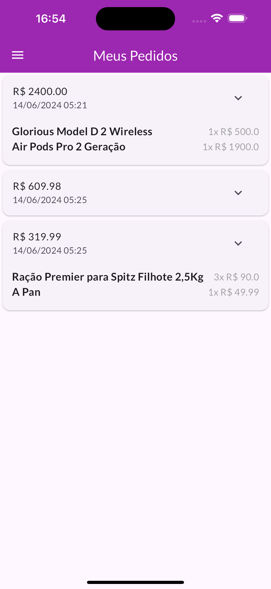
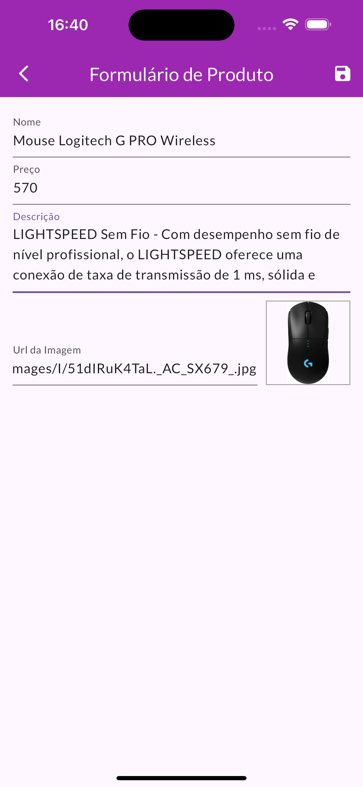
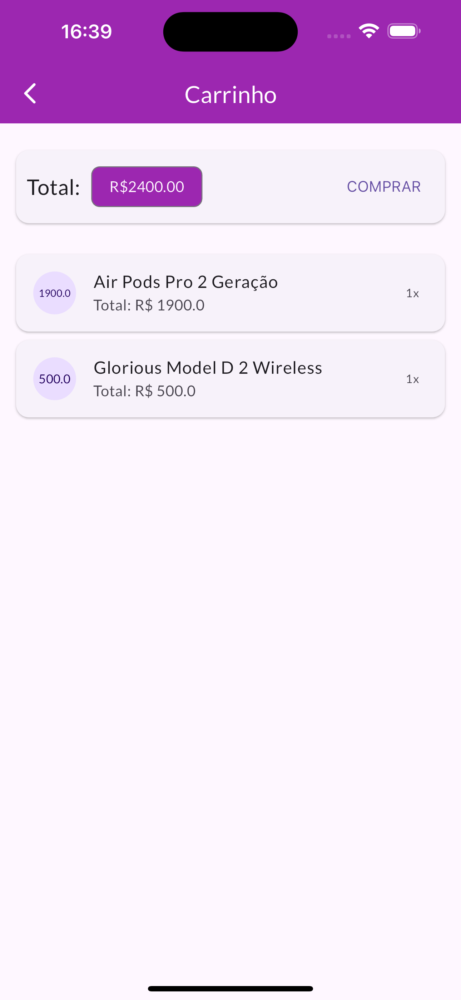

# recipes_app
Este é um aplicativo no qual seu intuito é mostrar receitas de diferentes categorias.

### O que eu aprendi neste aplicativo
Neste aplicativo, aprendi conceitos de Inherited Widget, provider, padrão de projeto Observer, ChangeNotifier, SnackBar, DialogBox, Formularios,API REST Firebase, Future, Async, AnimatededBuilder
<br>

> :construction: Projeto em construção :construction:


### Layout

> :construction: Projeto em construção :construction: <br>
   
  


#### GIFS

> :construction: Projeto em construção :construction:


## Como rodar o projeto?

Com flutter, dart e VSCode instalados e configurados em seu sistema operacional, abra o Prompt de comando (Terminal no macOS) e clone o repositorio utilizando este código<br>
```
git clone https://github.com/ArthurRCastilho/My-Shop.git
```
<br>
Após isso abra a pasta do repositório no seu VSCode.
Selecione qual dispositovo, ou emulador deseja debugar o software.
Abra o arquivo<br>

```
cd {Local que você salvou o diretorio}
```

<br>
E aperte para rodar o seu código, após alguns segundos o programa deve ser aberto para poder testar.

## Como foi feito este projeto?

Este projeto foi totalmente feito a partir de um curso da udemy, na qual você pode [clicar aqui](https://www.udemy.com/course/curso-flutter/?couponCode=ST6MT42324) para acessar o curso<br>

Neste projeto contém estruturas de fundamentos de flutter, sendo elas:
- [x] Inherited Widget;
- [x] Provider;
- [x] ChangeNotifier;
- [x] MultiProvider;
- [x] SnackBar;
- [x] Dialog Box;
- [x] Forms do Flutter;
- [x] Firebase;
- [x] Future;
- [x] Async e Await;
- [x] AnimatededBuilder;
- [x] Imagem Temporaria;
- [x] Transição Hero;
- [] Slivers;
- [] Transições de telas;

<br>
> :construction: Projeto em construção :construction:


## Contribua para o respositorio

Entre neste repositorio e crie uma Fork.

Clone o repositorio pelo Prompt de Comando (Terminal no MacOS)
```
git clone https://github.com/[seu_nome]/projetoperguntas.git
```
<br> Abra o repositorio pelo Prompt de Comando

```
cd {caminho/para_o/Repositorio/projetoperguntas}
```

<br> Crie uma nova Branch

```
git checkout -b {nome_da_Branch}
```

<br> Faça todas as alterações/contribuições que deseja

<br> E depois faça o commit de tudo que foi feito

```
git add .
git commit -m '{Alterações feitas}'
```

<br> Envie sua branch para o repositorio forked

```
git fetch upstream
git rebase upstream/main
```

<br>Agora basta enviar sua nova branch para o github

```
git push origin {nome da branch}
```

Por fim no seu github faça uma pull request

<br>

### Tecnologias utilizadas
- ``VSCode``
- ``Dart``
- ``Flutter``
- ``XCode = Emulador de IOs``
- ``Android Studio = Emulador Android``
- ``iPad = Emulador iPadOS``

