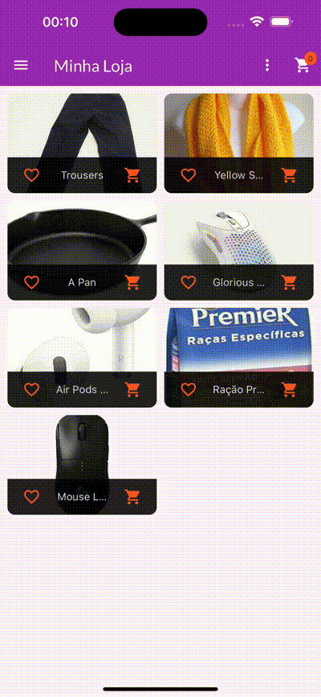
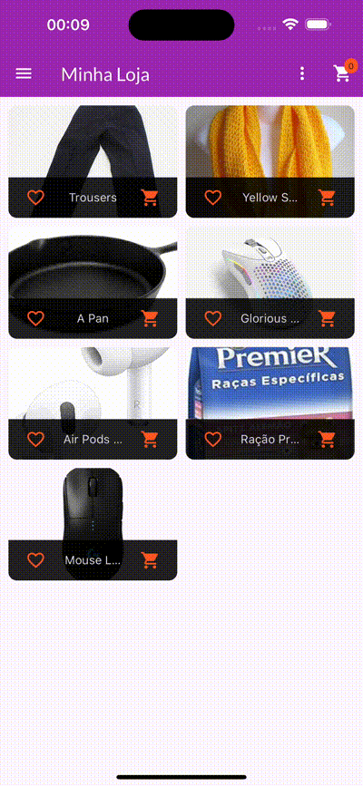

# recipes_app
Este é um aplicativo no qual seu intuito é mostrar receitas de diferentes categorias.

### O que eu aprendi neste aplicativo
Neste aplicativo, aprendi conceitos de Inherited Widget, provider, padrão de projeto Observer, ChangeNotifier, SnackBar, DialogBox, Formularios,API REST Firebase, Future, Async, AnimatededBuilder, Animation Hero e Transições de telas.
 

### Layout

   
  

#### GIFS

   

## Como foi feito este projeto?

Este projeto foi totalmente feito a partir de um curso da udemy, na qual você pode [clicar aqui](https://www.udemy.com/course/curso-flutter/?couponCode=ST6MT42324) para acessar o curso 

Neste projeto contém estruturas de fundamentos de flutter, sendo elas:
- [x] Inherited Widget;
- [x] Provider;
- [x] ChangeNotifier;
- [x] MultiProvider;
- [x] SnackBar;
- [x] Dialog Box;
- [x] Forms do Flutter;
- [x] Firebase;
- [x] Future;
- [x] Async e Await;
- [x] AnimatededBuilder;
- [x] Imagem Temporaria;
- [x] Transição Hero;
- [x] Slivers;
- [x] Transições de telas;

### Tecnologias utilizadas
- ``VSCode``
- ``Dart``
- ``Flutter``
- ``XCode = Emulador de IOs``
- ``Android Studio = Emulador Android``
- ``iPad = Emulador iPadOS``

